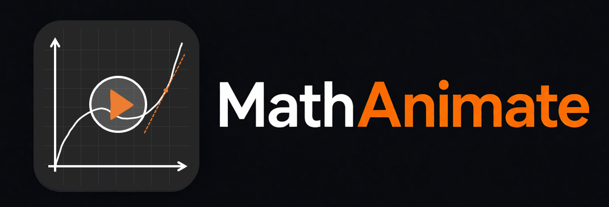
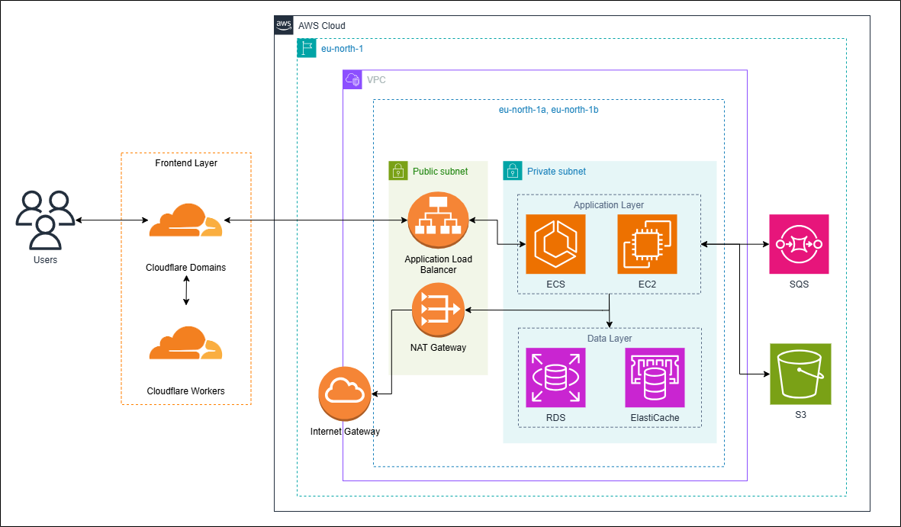
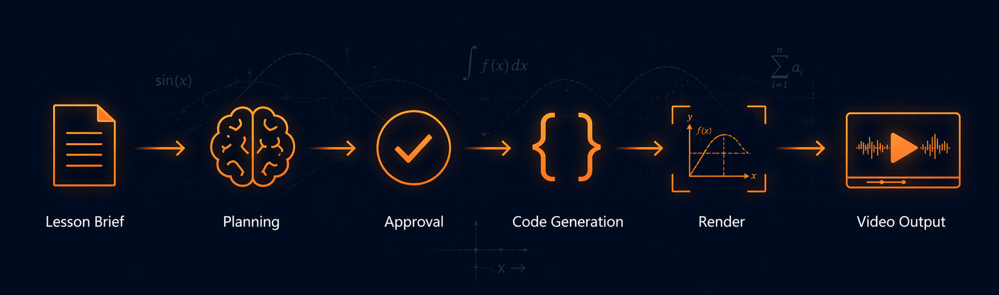

<p align="center">
  
</p>

<p align="center">
  <em>"AI-assisted lesson-to-video pipeline: submit a math lesson brief, review an AI-generated scene plan, and get a rendered Manim animation."</em>
</p>

<p align="center">
  <a href="https://github.com/Alonpenker/math-animate/actions/workflows/ci.yml">
    
  </a>
  <a href="infrastructure/">
    
  </a>
  <a href="LICENSE">
    
  </a>
</p>

<p align="center">
  <a href="https://mathanimate.com">🌐mathanimate.com</a>
</p>

---

## 🛠️ Tech Stack

| Layer | Technology |
|---|---|
| Frontend | React 19, TypeScript, Vite, Tailwind CSS 4, shadcn/ui |
| Backend API | FastAPI, Python 3.13 |
| Async processing | Celery + RabbitMQ |
| LLM pipeline | LangChain (OpenAI) |
| Job state | Redis |
| Database | PostgreSQL 16 + pgvector |
| Embeddings (RAG) | Ollama `nomic-embed-text` (768 dims) |
| Artifact storage | S3 (AWS) / MinIO (local) |
| Renderer | `manimcommunity/manim:v0.19.2` in Docker |
| Local runtime | Docker Compose |
| Infrastructure | Terraform, AWS (eu-north-1), Cloudflare Workers |
| CI/CD | GitHub Actions + OIDC |

---

## ☁️ AWS Architecture

<p align="center">
  
</p>

Cloudflare is the public edge. The ALB security group accepts traffic only from Cloudflare IPv4 ranges. All application and data-plane services run in private subnets.

| Service | Role |
|---|---|
| **Cloudflare Domains & Workers** | Frontend edge deployment |
| **ALB** | Public HTTPS entry point, Cloudflare IPs only |
| **ECS Fargate** | Stateless API container |
| **EC2** | Worker stack: Celery + Docker-in-Docker + Ollama |
| **RDS PostgreSQL** | Job state, artifact metadata, pgvector knowledge base |
| **ElastiCache Redis** | Celery result backend, Redis-backed job state |
| **SQS** | Render job queue |
| **S3** | Artifact storage (AES-256 SSE, 30-day lifecycle) |
| **Secrets Manager** | API keys, DB credentials, Docker Hub credentials |
| **CloudWatch Logs** | API and worker log streams |
| **SSM Session Manager** | Private worker access (no bastion, no open ports) |
| **Terraform** | Full infrastructure provisioning |
| **GitHub Actions OIDC** | Keyless deploy automation |

Full provisioning details: [infrastructure/](infrastructure/)

---

<p align="center">
  
</p>

**Pipeline:** `lesson brief` → `AI plan` → `approval gate` → `code generation` → `verification` → `isolated render` → `video artifacts`

---

## ⚙️ Application Logic

Every job follows a strictly enforced state machine. Illegal transitions raise an error immediately.

```
CREATED
  └─► PLANNING ──► PLANNED ──► (teacher approves) ──► APPROVED
                     │                                     │
               FAILED_PLANNING                          CODEGEN ──► CODED
                                                           │          │
                                                   FAILED_CODEGEN  VERIFYING
                                                                      │
                                              ┌───────────────────────┤
                                           OK │            NEEDS FIX  │   FAILED
                                              ▼                ▼      │     ▼
                                          RENDERING         FIXING    │  FAILED_VERIFICATION
                                              │          (1 retry)    │
                                         ┌───┤                └──────►┘
                                      OK │   │ FAILED
                                         ▼   ▼
                                      RENDERED   FAILED_RENDER
```

1. **Plan generation**: RAG-enriched prompt retrieves similar plan examples from pgvector. LLM drafts structured scenes.
2. **Teacher approval gate**: the plan is surfaced for human review before any code is generated.
3. **Code generation**: LLM generates Manim Python with RAG-injected code examples.
4. **Auto-fix pipeline**: generated code that fails syntax/import verification is automatically patched and re-verified (one retry).
5. **Isolated render**: Manim executes inside a fresh Docker container: no network, CPU/memory/PID limits.
6. **Artifact storage**: video, generated code, render logs, and scene plan are all persisted as typed artifacts.

---

## ✨ Key Features

- **Human-in-the-loop approval**: plan review before any code is generated
- **RAG-augmented generation**: planning and codegen prompts enriched via pgvector similarity search
- **Auto-fix pipeline**: failed verification triggers one LLM-assisted patch before hard failure
- **Sandboxed rendering**: Manim runs in a network-isolated container; code never executes in the API or worker
- **Token budget enforcement**: 250K daily cap with pessimistic reservation and per-job ledger tracking
- **Lesson library**: browse rendered videos and download artifacts by type
- **Job history**: full state timeline with failure details
- **Usage visibility**: daily token consumption dashboard

---

## 📚 Docs

- [backend/README.md](backend/README.md) - API reference, job lifecycle, project structure, configuration
- [frontend/README.md](frontend/README.md) - dev modes, stack, directory layout
- [infrastructure/README.md](infrastructure/README.md) - AWS services, Terraform setup, day-to-day ops

---

## 📄 License

[MIT](LICENSE)
